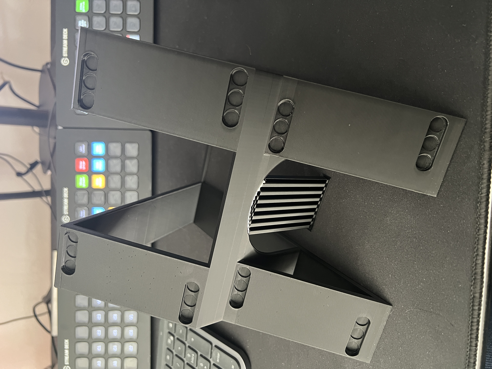

Elgato Stream Deck XL Dual Stand
================================

Abstract
--------

This is a custom stand for the awesome
[Elgato Stream Deck XL](https://www.elgato.com/es/de/p/stream-deck-xl)
consumer product, a USB-connected programmable 32 key block. This custom
stand allows to seamlessly stack two Stream Deck XL devices and is
intended for scenarios with limited desk space.

Origin
------

This custom stand was originally designed for the
[msg Filmstudio](https://msg.direct/filmstudio-trailer), the studio of
[Dr. Ralf S. Engelschall](mailto:ralf.engelschall@msg.group) (CTO) at
[msg](https://www.msg.group). This studio is driven by a control room
with about two dozen Stream Deck XL devices, spread over five desks and
controlled through [Bitfocus Companion](https://bitfocus.io/companion).
The primary position of the event Director uses such a lot of necessary
keys to control a production that the Stream Deck XL devices initially
had up to three configured pages in Companion.

As this was too impractical during an event, the Director position now consists
of a desk with 11 Stream Deck XL devices and nearly no necessary paging
on each device, so the director can reach all keys immediately. This
was only possible through stacking the Stream Deck XL devices with the
help of this custom dual stand, which Noah S. Engelschall designed
in 3D in [Blender](https://blender.org) and printed on a
[Bambu Lab X1](https://bambulab.com/de-de/x1) 3D printing device.

Design Criterias
----------------

The dual stand allows two Stream Deck XL devices to be stacked in the
usual angle of the original stand. The stand itself is optimized to
consist of as less printing material as possible and require just a
single support structure during printing. The dual stand contains 24
holes for small self-adhesive 8x1mm magnets and at the bottom 2 holes form
self-adhesive anti-slip silicon material.

Impressions
-----------

The following shows some impressions of the dual stand. First, the
3D model in Blender. Second, the 3D model printed inside Bambu Lab
X1. Third, the resulting dual stand (still with the necessary support
structure in the middle). Forth, the dual stand fifth times on the
desk of the Director at the msg Filmstudio. As a result, the Director
has 10x32 (Stream Deck XL) plus 1x16 (Stream Deck+) or in total 336
keys at hand. These 336 keys allows the Director to reach nearly all
functionality with a single key press.

Resources
---------

The following are all resources of this dual stand.
First, the design artifacts and the corresponding screencast.
Second, the 3D printing format and the printing process timelaps.
Third, photos of the resulting dual stand.

### Design

- [Blender Software](https://blender.org)
- [3D model (Blender design format)](./elgato-stream-deck-xl-dual-stand-model.blend)
- [3D model (Blender screencast)](./elgato-stream-deck-xl-dual-stand-model.mp4)

### Printing

- [3D model (STL export format)](./elgato-stream-deck-xl-dual-stand-model.stl)
- [Bambu Lab X1 3D printing device](https://bambulab.com/de-de/x1)
- [Stand printing process](./elgato-stream-deck-xl-dual-stand-printing.m4v)

### Completion

- [8x1mm self-adhesive magnets](https://www.amazon.de/dp/B0BJQ918KX)
- [2mm self-adhesive silicon](https://www.amazon.de/dp/B071CGN92T)

### Result

- [Stand result (photo 1)](./elgato-stream-deck-xl-dual-stand-result-1.jpg)
- [Stand result (photo 2)](./elgato-stream-deck-xl-dual-stand-result-2.jpg)
- [Stand result (photo 3)](./elgato-stream-deck-xl-dual-stand-result-3.jpg)
- [Stand result (photo 4)](./elgato-stream-deck-xl-dual-stand-result-4.jpg)
- [Stand result (photo 5)](./elgato-stream-deck-xl-dual-stand-result-5.jpg)
- [Stand result (photo 6)](./elgato-stream-deck-xl-dual-stand-result-6.jpg)
- [Stand result (photo 7)](./elgato-stream-deck-xl-dual-stand-result-7.jpg)

Authors
-------

Noah S. Engelschall 
Dr. Ralf S. Engelschall

Copyright & License
-------------------

Authored by msg Research, msg systems ag 
Copyright &copy; 2024 [msg systems ag](https://www.msg.group) 
Licensed under [MIT](https://spdx.org/licenses/MIT) license.

